# Open Muse

**一个会记事、会跟进、能动手的个人 AI 助手。它在你的 iPhone 上，在你的 Mac 上，也在一台云端电脑上——你关掉 App，它还在继续干活。**

[English](README.md) | 简体中文 | [官网](https://getopenmuse.com/zh/)

<table>
  <tr>
    <td width="16%">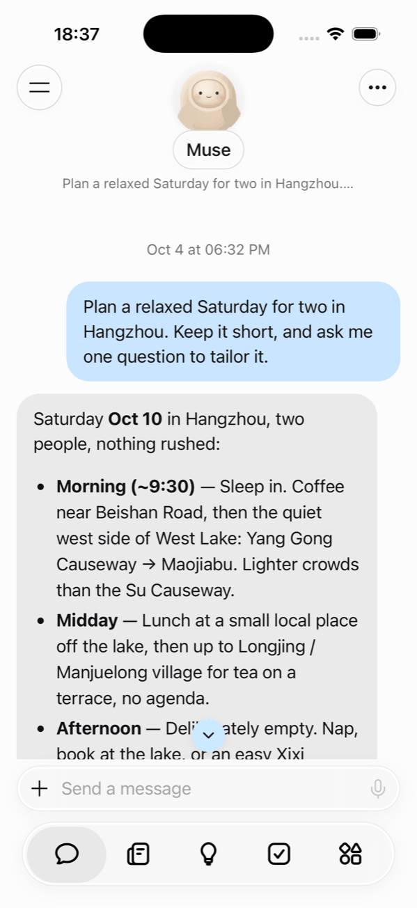</td>
    <td width="16%">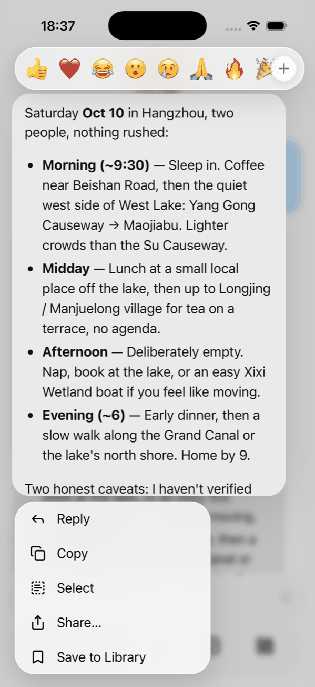</td>
    <td width="16%">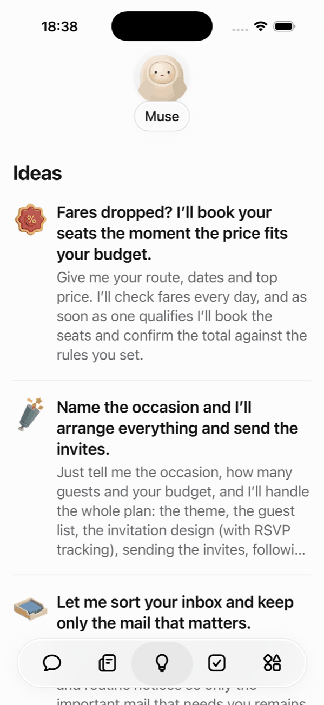</td>
    <td width="16%">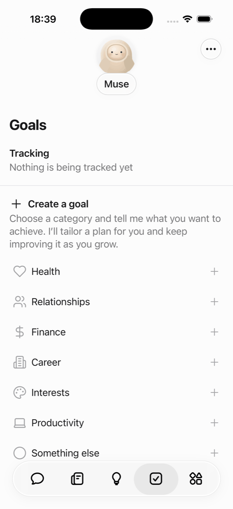</td>
    <td width="16%">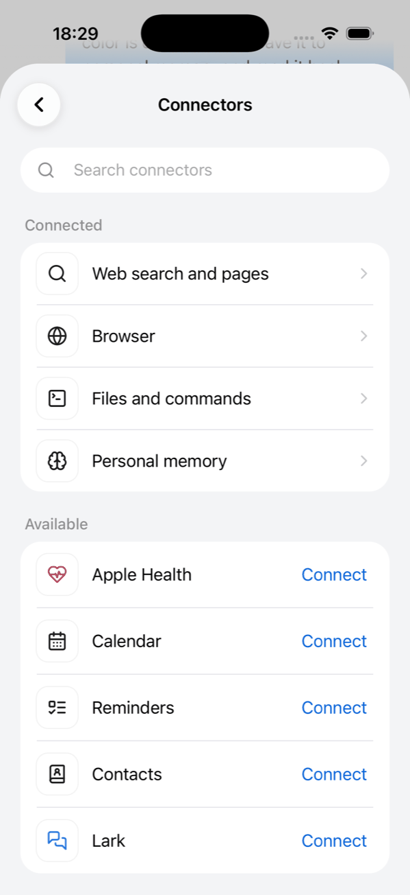</td>
    <td width="16%">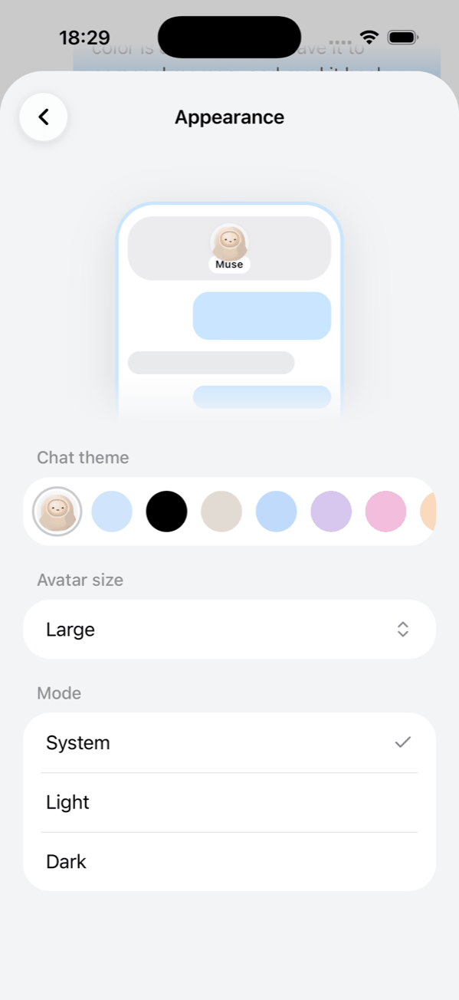</td>
  </tr>
  <tr>
    <td align="center"><sub><b>先给方案，再问一句。</b>简短的计划，加一个让它更贴合你的问题。</sub></td>
    <td align="center"><sub><b>长按回复。</b>表情回应、引用回复、复制、分享，或存进资源库。</sub></td>
    <td align="center"><sub><b>从点子开始。</b>现成的任务，直接交给助手。</sub></td>
    <td align="center"><sub><b>会成长的目标。</b>选个类别，得到一份持续改进的计划。</sub></td>
    <td align="center"><sub><b>连接你常用的。</b>Apple 健康、日历、提醒事项、通讯录和飞书。</sub></td>
    <td align="center"><sub><b>按你的喜好。</b>气泡颜色、形象大小、浅色或深色。</sub></td>
  </tr>
  <tr>
    <td width="16%">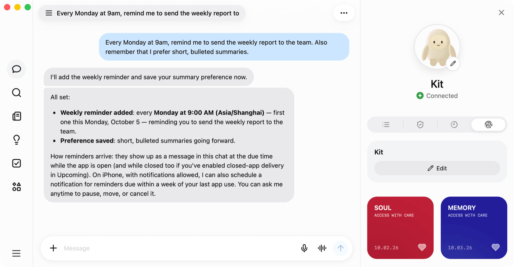</td>
    <td width="16%">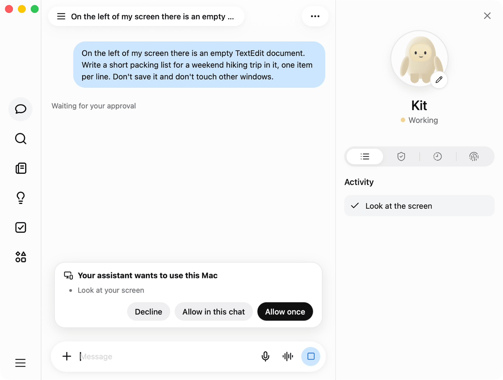</td>
    <td width="16%">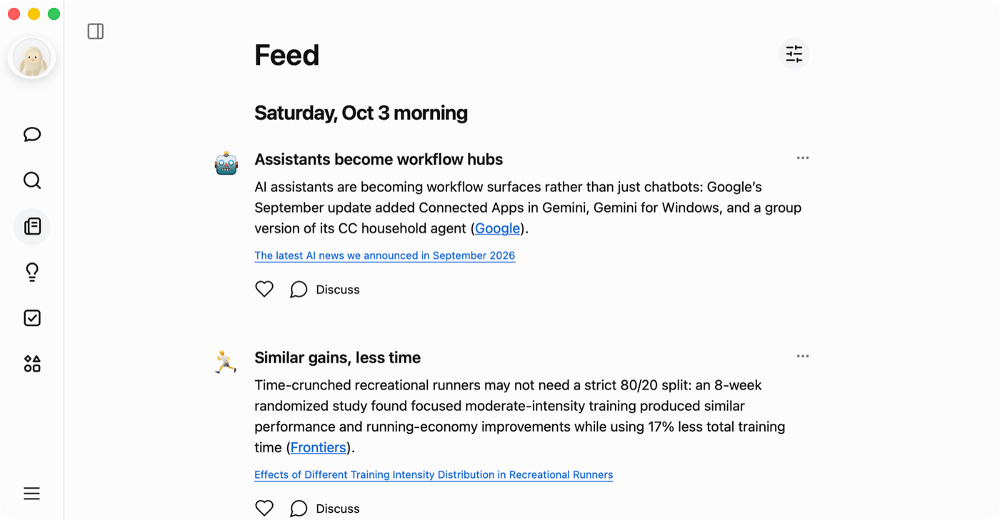</td>
    <td width="16%">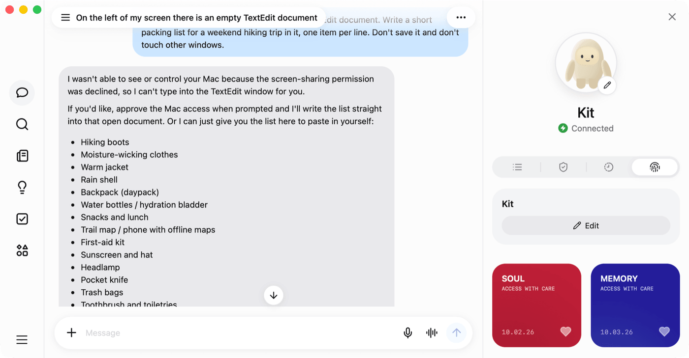</td>
    <td width="16%">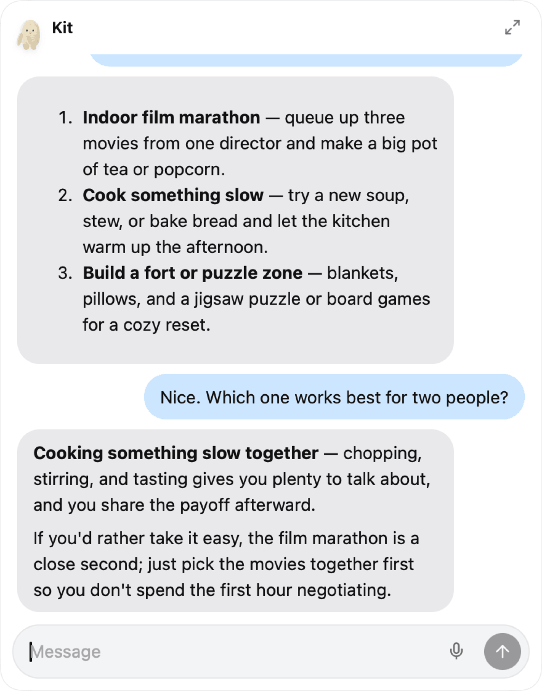</td>
    <td width="16%">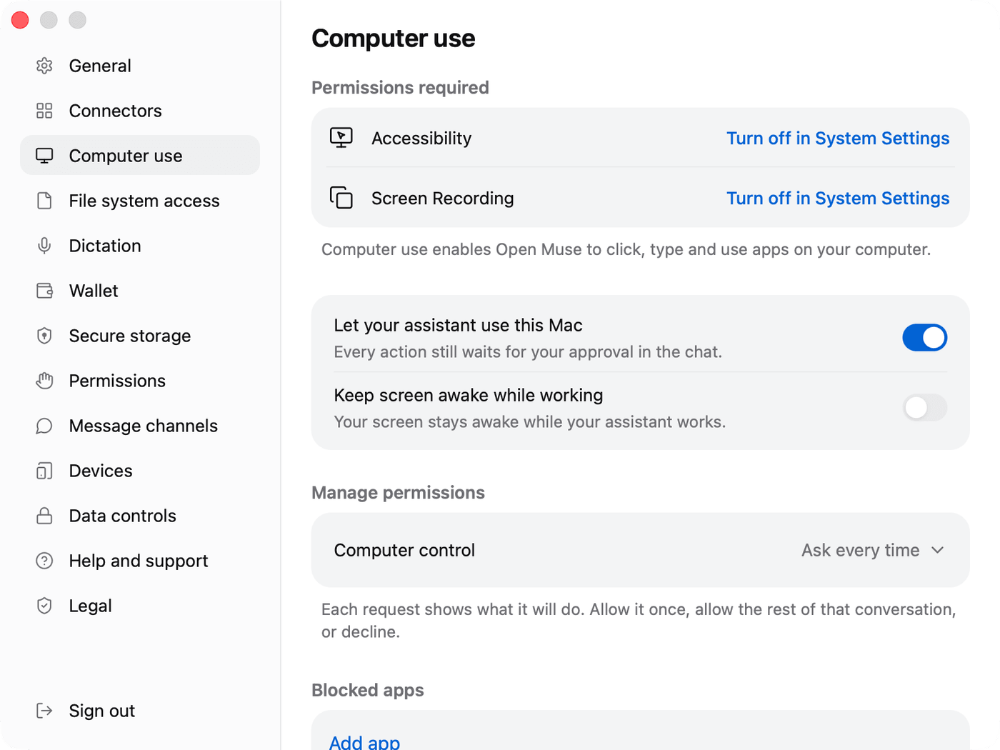</td>
  </tr>
  <tr>
    <td align="center"><sub><b>记得住，会提醒。</b>一句话设好每周提醒，偏好存进你能打开查看的记忆。</sub></td>
    <td align="center"><sub><b>会用你的 Mac，但先问你。</b>允许一次、在此对话中允许，或拒绝。</sub></td>
    <td align="center"><sub><b>只属于你的动态。</b>按你选的主题每天更新，每条都附来源。</sub></td>
    <td align="center"><sub><b>说不就是不。</b>你拒绝后，它不碰你的电脑，改在对话里帮你。</sub></td>
    <td align="center"><sub><b>随叫随到。</b>不打断手头的事，小卡片直接聊。</sub></td>
    <td align="center"><sub><b>边界由你定。</b>权限、屏蔽的 App 和文件夹，集中在一处管理。</sub></td>
  </tr>
</table>

<sub>截图为英文界面；应用内置简体中文，会跟随系统语言。</sub>

## 基于 Managed Agents 构建

Open Muse 是 **Managed Agents（MA）** 服务的客户端。MA 托管智能体的运行循环，提供可持久保存、带版本的智能体，隔离的云端环境，以事件流方式推进的会话，以及记忆库。每个工作区对应一个智能体、一个环境和一个记忆库，每段对话都是一个 MA 会话。应用用你自己的 Key 直接调用 MA 接口，Open Muse 不代理任何模型请求。

| 后端 | 状态 |
| --- | --- |
| [火山方舟 Managed Agents](https://www.volcengine.com/product/ark) | 默认的基准后端。本文介绍的所有功能都在它上面实现并验证过。 |
| [Claude Managed Agents](https://platform.claude.com/docs/en/managed-agents/overview) | 资源模型相同的备选后端，用来保持后端可替换。方舟独有的能力（例如从方舟模型目录里为单段对话选模型、按项目划分的 Key）不提供。尚未端到端验证。 |

构建时用 `VITE_MUSE_MA_PROVIDER` 选择后端（默认 `ark`，可选 `claude`），Open Muse 服务用 `MA_PROVIDER` 选择，两者必须一致。后端之间的所有差异都集中在 [`shared/ma-provider.ts`](shared/ma-provider.ts)。

## 它能做什么

**按需读懂你的身体（iPhone）。** 问一句「今天练得怎么样？」或「这周睡得比上周好吗？」，Open Muse 会当场读取 Apple 健康：步数、活动能量、锻炼分钟、步行与跑步距离、心率、静息心率、睡眠、运动记录和体重。在应用里连接 Apple 健康之前，每次读取都会先问你；连接之后直接读取，在连接器里断开即恢复逐次询问。读不到的数字，它绝不编造。

**亲手操作你的 Mac。** 经你允许后，助手可以查看屏幕，打开 App、文件和链接，点击、输入、滚动、按快捷键——任何 App 都行，不管它有没有 API。它还能读取你的日历和大致位置。每个动作都会先等你批准（除非你选择在本对话中允许，或在设置里选了「始终允许」），你屏蔽的 App 和文件夹它碰不到。

**飞书，一句话办完。** 云端电脑预装了飞书 CLI 和官方技能。在「连接器」里登录一次，之后直接用大白话：开会前给我一页简报、把今天的群聊整理成任务、帮三个人找个都有空的时间并订好会议室、把昨天的会议纪要写成文档。

**一台一直在干活的云端电脑。** 每个工作区都运行在火山方舟 Managed Agents 上，有自己隔离的 Linux 沙箱：网页搜索、真正的 Chrome 浏览器、带 Python 和 Node 的终端，以及文件。让它比价并截图留证、出一份 PDF 报告、写个脚本分析表格，然后关掉 App——工作会继续，等你回来时结果已经在那里。

**它记得，也会跟进。**
- 和你一起起名、定性格，把重要的事记在你能查看和编辑的记忆里。
- 把目标拆成有步骤的计划，并定期跟进。
- 单次、每天、每周或每月提醒你——在对话里提醒，iPhone 上还有通知。
- 根据你的目标和近期对话，准备个人化的「动态」和「点子」。

**同一个助手，所有设备。** 在 iPhone 上开始，在 Mac 上继续。健康数据只在拥有它的那台 iPhone 上读取；Mac 上的操作只在 Mac 上执行。对话、记忆、目标和提醒都跟着你的 Open Muse 账号走。

## 值得信任

- **动你的设备之前先问。** 操作 Mac 或读取 Apple 健康都要等你同意，除非你提前选择允许；日历和定位每次调用都会单独询问。云端工具只在你自己的隔离沙箱里运行。
- **不假装回答。** 没有可用连接时，应用会直接说明，从不生成模拟回复；结果不确定的写操作会先核对，不会重复执行。
- **你的 Key，你的工作区。** 应用用你自己的 API Key 直接调用火山方舟。使用 Open Muse 账号时，Key 会为你的账号加密保存，在设备上只放在内存里；共用同一个 Key 的不同账号，工作区、记忆和历史依然相互隔离。
- **记忆看得见。** 助手的名字、人格和记住的事实都是普通文档，你可以打开、修改或清空。

## 应用

| 平台 | 状态 |
| --- | --- |
| iPhone | 主力应用：对话、Apple 健康、附件、提醒和通知 |
| Mac | 原生外壳：电脑操控、日历和定位、快速聊天、听写和语音对话 |
| Web | 移动优先的网页版：对话、动态、点子、目标和资源库 |
| Android | Android 9 及以上的 iPhone 版对应应用：Health Connect（Android 14 及以上）、日历和通讯录、附件、提醒和通知；已在一台手机上测试。[下载](https://getopenmuse.com/zh/#android) |

内置英文和简体中文，跟随系统语言。

## 开始使用

你需要一个能使用 Managed Agents 的[火山方舟](https://www.volcengine.com/product/ark) API Key。构建应用后，打开「设置 → 连接 Ark MA」，粘贴 Key 即可。第一次对话会自动准备好你的智能体、云端环境和记忆。云端调用费用计入你的方舟账号。

```bash
npm ci
npm run dev           # 网页版：http://127.0.0.1:4310
npm run macos:build   # Mac 应用：.build/macos/
npm run ios:build     # iOS 模拟器应用
```

需要 Node.js 22.21+；构建 Apple 应用还需要 Xcode。

## 文档

以下文档为英文：

- [Development](docs/development.md)：构建、运行、账号构建、原生工程和目录结构
- [How it works](docs/how-it-works.md)：账号、存储与安全、对话、记忆、目标、提醒、动态和点子
- [Cloud environment toolbox](docs/environment-toolbox.md)：沙箱里的浏览器和飞书工具
- [Verification](docs/verification.md)：各平台的验证情况
- [Open Muse service](server/README.md)：账号、加密的 Key 和后台任务
- [Contributing](CONTRIBUTING.md) · [Third-party notices](THIRD_PARTY_NOTICES.md)
